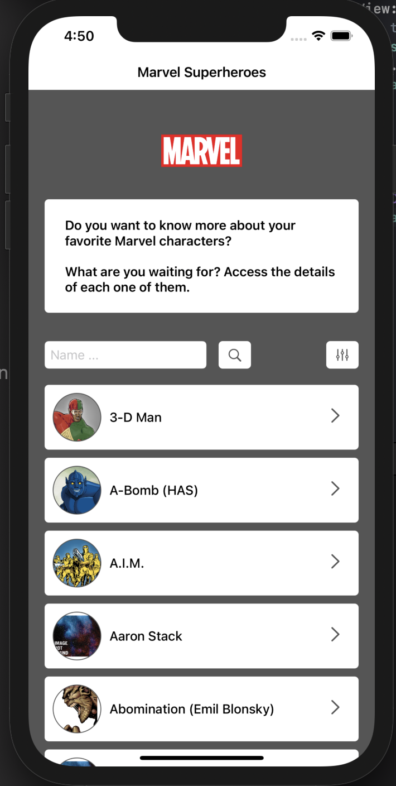
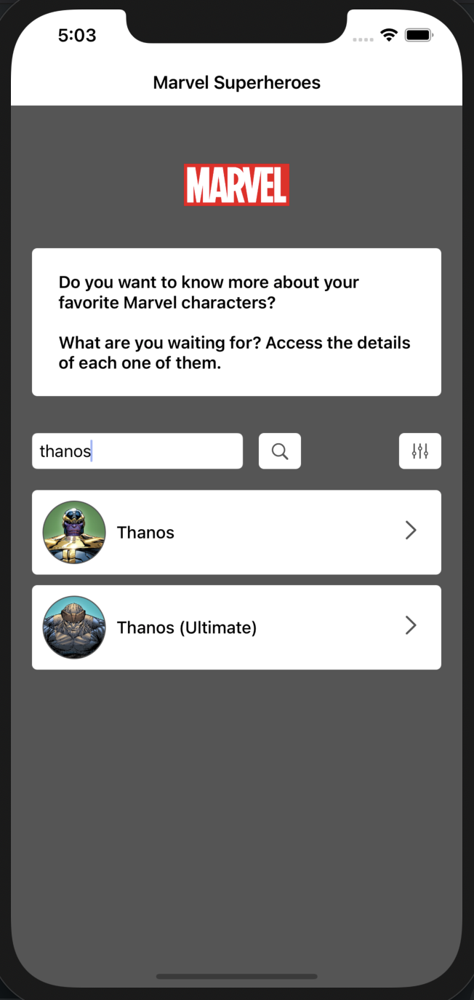
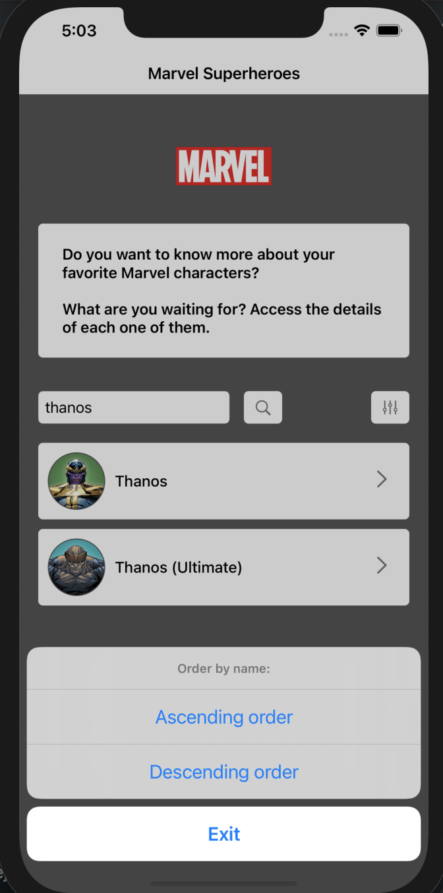
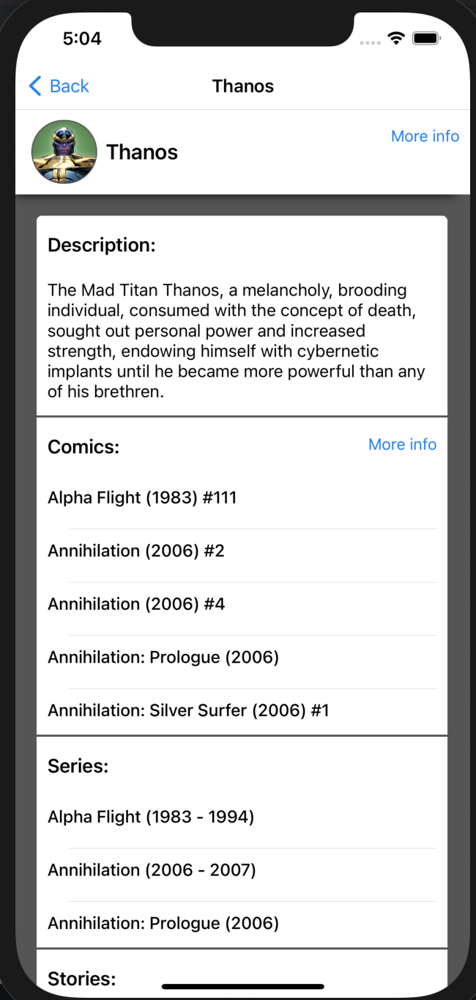
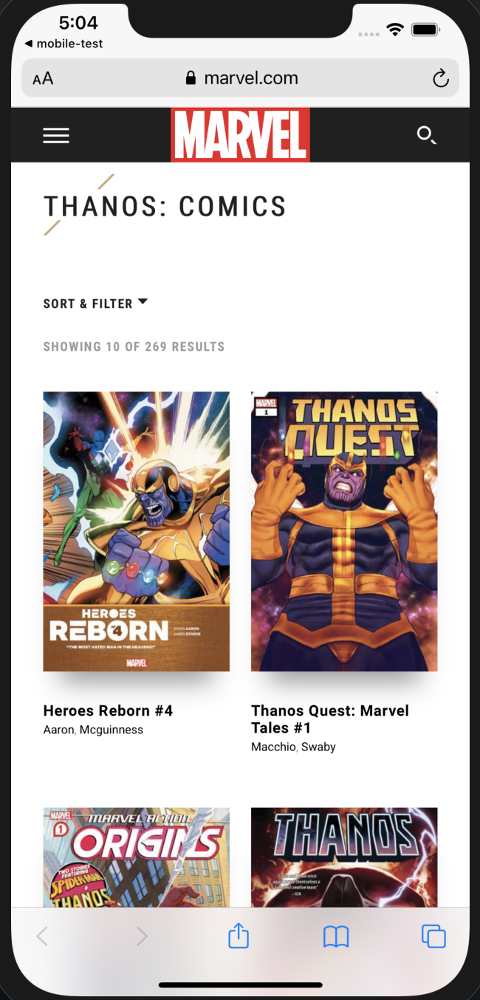

# MarvelSuperheroes-swift
A simple sample iOS application developed on Swift 5 with VIPER architecture and unit testing. 
In this app you can find from https://developer.marvel.com/docs info about marvel superheroes. You can also see the detail of each one.

## Project info
> - Xcode 12.5.1
> - Swift 5.0
> - VIPER
> - Swift Package Manager

## Architecture: VIPER
VIPER is an application of Clean Architecture to iOS apps. The word VIPER is an acronym for View, Interactor, Presenter, Entity, and Routing. Clean Architecture divides an app’s logical structure into distinct layers of responsibility. This makes it easier to isolate dependencies (e.g. your database) and to test the interactions at the boundaries between layers.

## 3rd Party Frameworks used
> - Alamofire
> - CryptoKit

### APIClient
Class with functions that retrieve data from Marvel's API.

### Utils
Class that helps the user with a variety of functionalities.

### Obfuscator
Class that encrypts and decrypts sensitive info such as private keys. We can use this class in APIClient

### Unit Testing
I include unit testing for APIClient, simulating the user interaction in the app with the retrieved data.

### Features
- Application in Spanish and English language
- Search for a specific superhero name. E.g "thanos"
- Sort by ascending and descending name
- When the user scrolls down, new data is loaded from server
- Detail of the superhero, including data about series, comics...
- The user can see more info associated to the superhero in the Safari browser

### Screenshots
 
 

#### Meta
Sergio Martín León - [LinkedIn](https://www.linkedin.com/in/sergio-mart%C3%ADn-le%C3%B3n-4ba502174/) - [Email](sergirealleon@gmail.com)
